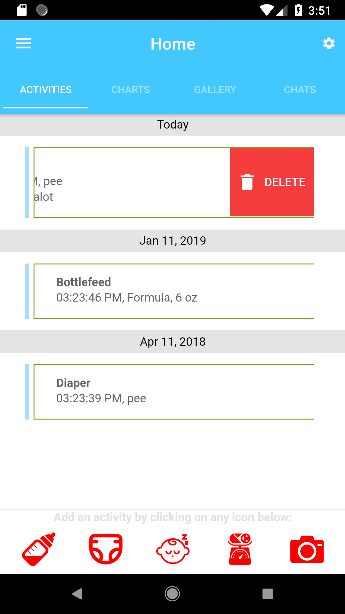
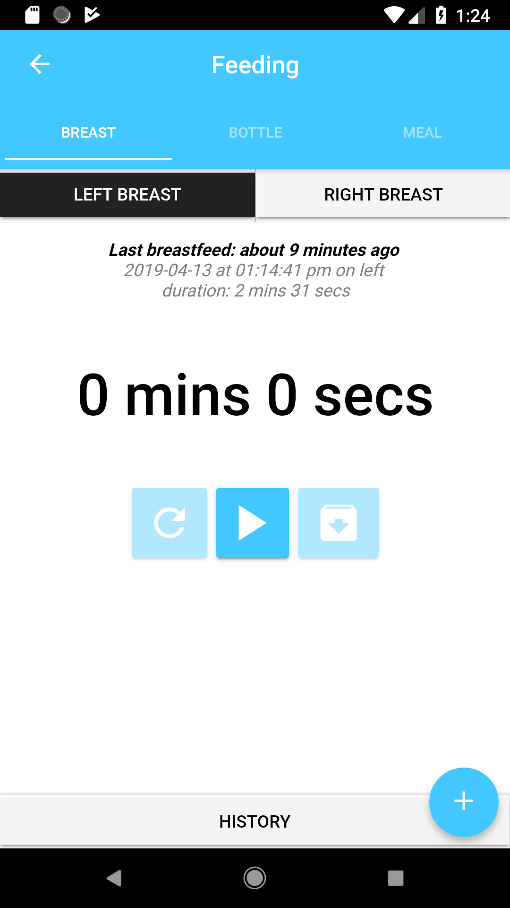

# FirstYear
This is an android app using the Ionic Framework and Google's Firebase to store information that will help keep track of the user's baby's or babies daily essential activities such as feeding, diapering, and sleeping. The user may also keep a record of his/her baby or babies' growth as well.

<b>Please note:</b> This is an ongoing project and some of functionalities (titles) that you can see in the home page segments are functionalities that I have not yet finished if it is not listed below (i.e. Charts, Gallery, Chats). All other sub-segments within the activities such as feeding are finished. 
 

## Welcome Page:
Users have the option login with normal username/password credentials, Google+, Facebook, or Twitter. If an account is not recognized by or not in Firebase's Authentication system via the login button, then the user will have the option to signup. Signing in with Google+, Facebook, or Twitter will automatically add users to the Firebase Authentication system. 

 

## Home Page: 

### Activities Segment:
In this segment of the home page, each logged activitiy will be display here in chronological order from the latest to the oldest. At the bottom of the screen is a fixed footer that contains clickable icons for each activity. When an icon is clicked, it will take the user to the appropriate view. 

 

Users can swipe the activity item left for the option to delete it.

 

Users can also swipe the activity item right to edit the information. 

 

<b>Bottlefeeding:</b>  
Clicking on the icon feeding will take the user to this page. Bottlefeeding is set as the preference by the app to be the first segment displayed when entering this view. The user can swipe left or right to a different segment view for feeding. Later, I will add the option for the user to choose which segment should be open first upon entering the feeding page. 

For bottlefeeding, users can choose the type of fluid, volume in oz or ml, and add any notes. The right row displays a timer for the feeding event. Timing is optional and if there exists a time, the detail for the feeding time will be displayed with the activity item. The next column shows the latest bottlefeed. This event listener will automatically update relative to the current time and the latest bottlefeeding time recorded. The information below this shows the history for the baby's bottlefeedings. I plan to make the items in this list editable in the future. 

Users might miss or forget to record a bottlefeeding event. When this happens, users may manually add a bottlefeeding event by pressing the FAB button on the bottom right. 

 

The FAB button will take the user to a modal to save the bottlefeeding details. Notice that the user now have the option to enter the date, time, and duration instead of the current time being automatically logged when the save icon is pressed. 

 

<b> Breastfeeding:</b>  
Breastfeeding follows the same format as the bottlefeeding activity. The buttons on the very top, below the segment headings, allows the user to select between left or right breast. Below that shows the last breastfeeding that was recorded with a "moments ago" time relative to the current time. Below are three buttons that will control the timer. 

 

In an effort to help with avoiding user-error, I have disabled the refresh and save buttons, far-left and far-right, from becoming functional until the record button, center button, is pressed and the button is pressed again for the time to paused.

Timer started:

Timer paused:

